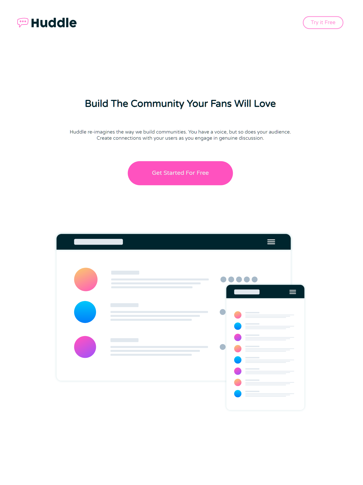

# 💬 Huddle Landing Page

A modern and responsive landing page for the Huddle platform. Built with HTML, CSS.

This the preview of my site for Desktop computers (vary device to device)
.png)

## 📱 Responsive Preview

Website looks great on all devices:  
🖥️ Desktop | 📱 Mobile | 💻 Tablet

---

## 🚀 Live Demo
Get live preview of my site here

🔗 [View Live Site](https://sythexis-huddle.netlify.app/)

---

## 🛠️ Built With

- HTML5
- CSS3
- Flexbox & Media Queries
- Google Fonts
- Git & GitHub

---

## 🎯 Features

- Clean and modern UI
- Fully responsive layout
- Mobile-first design approach
- Social media icons (footer)
- Hover effects and button interactions

---

## 📸 Screenshots

Screenshots of my site on different devices

### 📱 Mobile View

### 🖥️ Tablet View

---
**This is project and design in provided by FrontEnd Mentor**
I don't down any of these assets and design. visit FrontEnd mentor site to get all assets and design offically.

